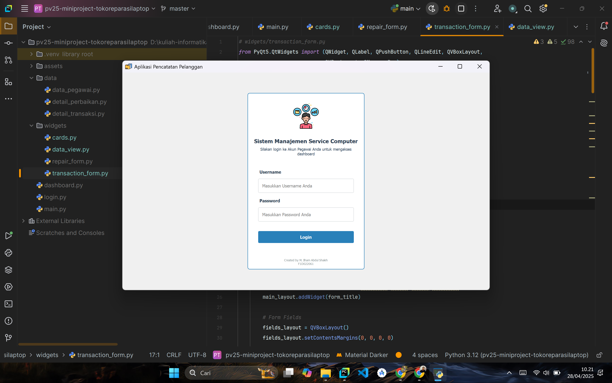
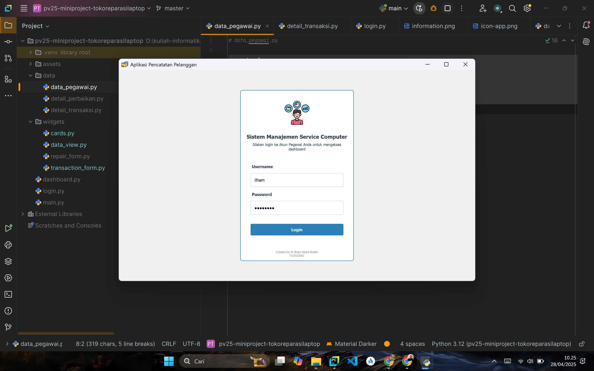
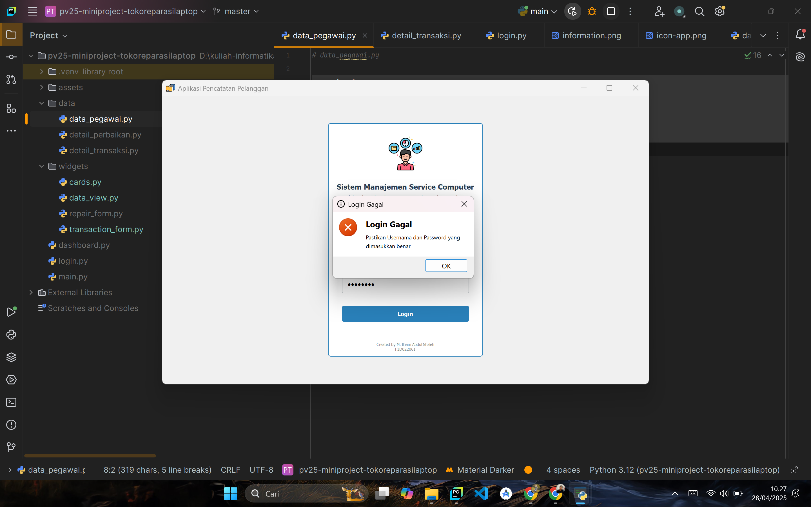
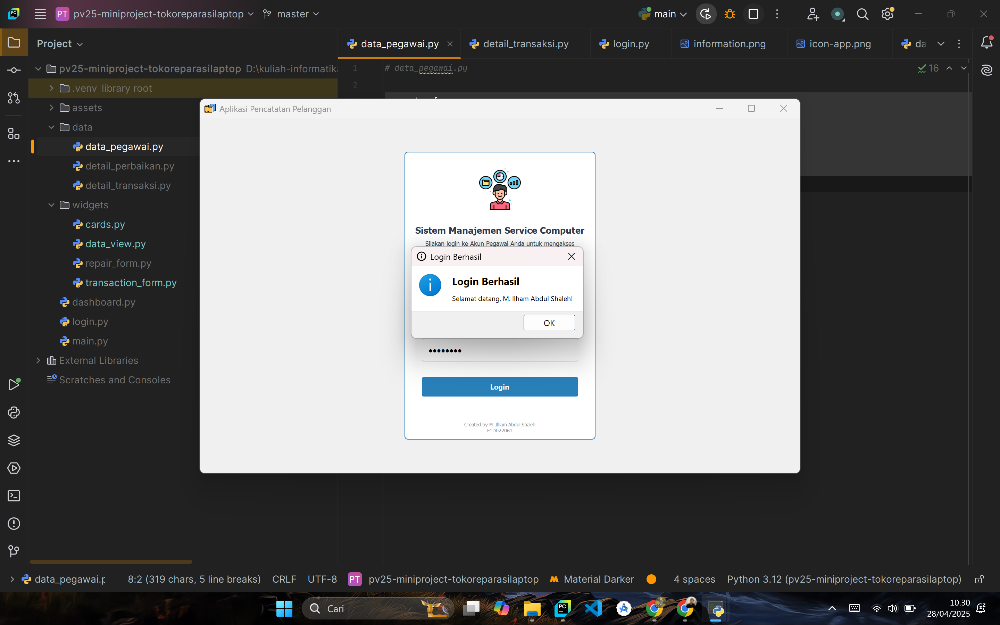
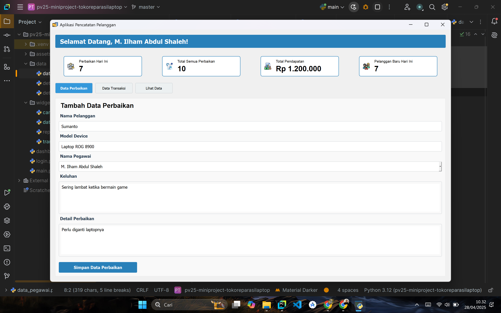
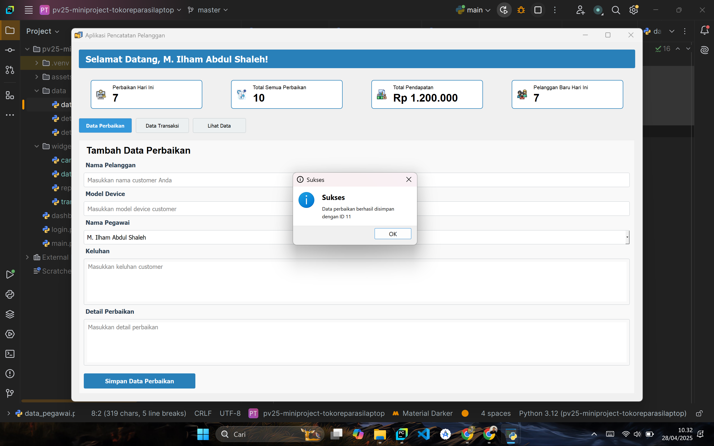
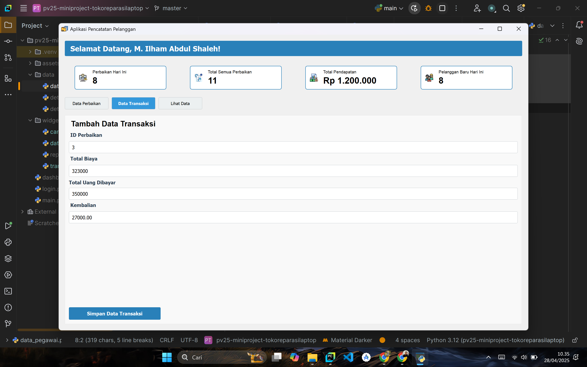
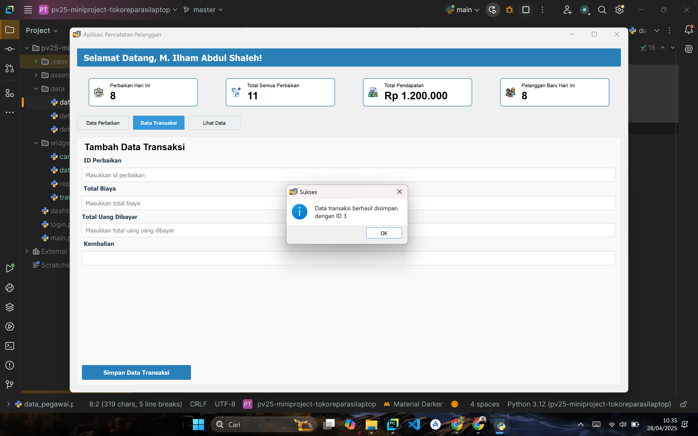
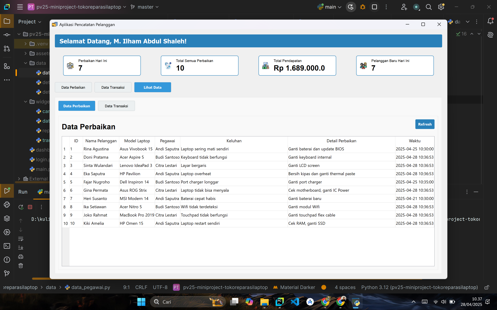
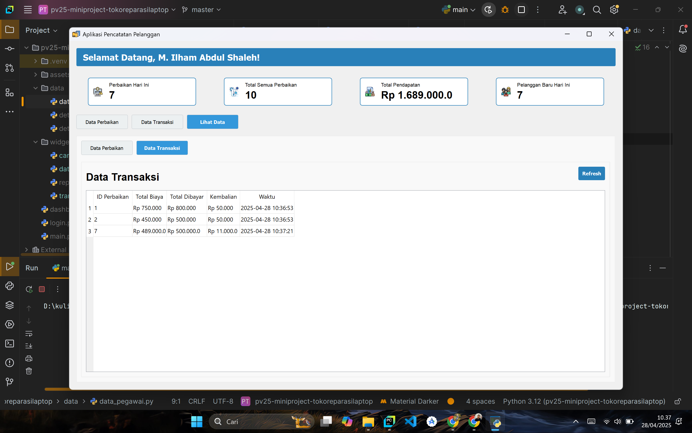

# Sistem Manajemen Toko Service Komputer

## Konsep Aplikasi
Aplikasi ini dikembangkan untuk membantu pemilik atau pegawai toko service komputer dalam mencatat dan melacak barang yang diperbaiki serta mengelola transaksi.  
Terinspirasi dari kebutuhan seorang teman yang ingin membuka toko service komputer, aplikasi ini dirancang untuk mempermudah pencatatan dan pengelolaan toko.

**Fitur utama yang ditawarkan:**
- **Login Pegawai:** Sistem autentikasi untuk pegawai yang dapat mengakses fitur tertentu.
- **Pencatatan Barang yang Diperbaiki:** Mencatat barang yang masuk untuk diperbaiki, termasuk informasi pelanggan dan detail kerusakan.
- **POS Transaksi:** Pencatatan transaksi perbaikan barang, melacak pendapatan, serta menyusun laporan transaksi.

Aplikasi ini dikembangkan menggunakan **PyQt** dan **Qt Designer**, dengan fokus pada kemudahan penggunaan dan fungsionalitas yang efisien.

---

## Langkah Pengembangan

1. **Perencanaan Awal**
   - Menentukan kebutuhan utama: sistem login pegawai, pencatatan barang perbaikan, dan sistem transaksi.
   
2. **Desain Awal di Qt Designer**
   - Aplikasi awalnya dirancang menggunakan Qt Designer. Namun, hasil konversi tidak sesuai harapan.
   - Akhirnya diputuskan untuk menulis ulang UI secara manual menggunakan **PyQt**.

3. **Struktur Project**
   - `assets/` — Menyimpan gambar dan ikon aplikasi.
   - `widgets/` — Menyimpan komponen UI.
   - `data/` — Menyimpan data pegawai, data perbaikan, dan data transaksi.
   - `login.py`, `dashboard.py`, `main.py` — File utama aplikasi.

4. **Pengkodean dan Implementasi**
   - Membuat halaman login.
   - Membuat dashboard utama.
   - Membuat menu pencatatan perbaikan barang.
   - Membuat menu transaksi dan melihat data.
   
5. **Penyesuaian Tampilan**
   - UI diperindah menggunakan **StyleSheet** agar aplikasi lebih modern dan nyaman digunakan.

---

## Menu Aplikasi

1. **Login Pegawai**
   - Username dan password diperlukan untuk mengakses aplikasi.
   - Data pegawai tersimpan di file `data/data_pegawai.py`.
   
   **Pegawai Terdaftar:**
   - Ilham (Username: `ilham`, Password: `ilham123`)
   - Andi
   - Budi
   - Citra

   Jika login gagal (username/password salah), akan muncul pop-up error.  
   Jika login berhasil, akan muncul pop-up sukses dan langsung diarahkan ke dashboard.

2. **Pencatatan Barang yang Diperbaiki**
   - Mengisi form: nama pelanggan, model device, keluhan customer, dan detail perbaikan.

3. **Pencatatan Transaksi**
   - Mengisi form: ID barang yang selesai diperbaiki, total biaya, dan jumlah yang dibayarkan.

4. **Melihat Data**
   - Klik menu "Lihat Data" untuk menampilkan seluruh data perbaikan dan transaksi yang tersimpan.

---

## Tampilan UI

| No | Tampilan                | Gambar |
|:-|:------------------------|:-|
| 1 | Halaman Login           |  |
| 2 | Input Data Login        |  |
| 3 | Pop-up Login Gagal      |  |
| 4 | Pop Up Login Sukses     |  |
| 5 | Dashboard               |  |
| 6 | Form Input Perbaikan    |  |
| 7 | Pop-up Sukses           |  |
| 8 | Form Input Transaksi    |  |
| 9 | Pop-up Sukses           |  |
| 10 | Data Barang Tercatat    |  |
| 11 | Data Transaksi Tercatat |  |

